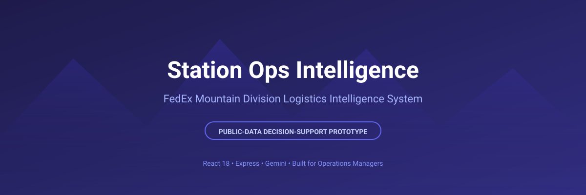
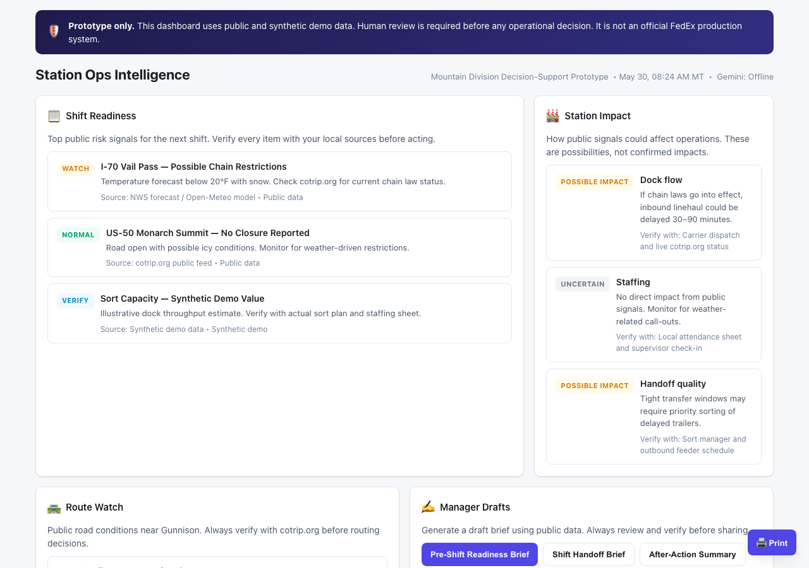
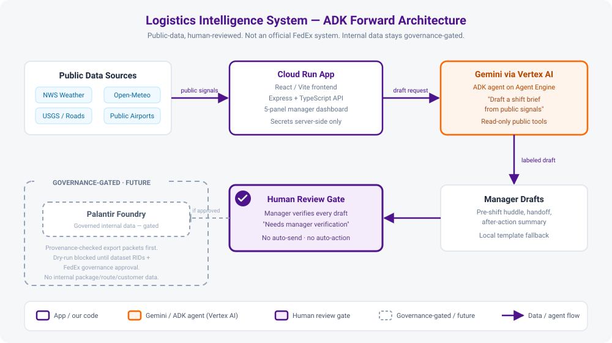

# FedEx AI Efficiency Hub

<p align="center">
  
</p>

An operations-led collection of working AI tools, analysis apps, prompts, and
guides for FedEx station and hub teams — built and maintained by operations
people. Everything here runs on **public or synthetic data only**, every AI
output is a draft that a person reviews, and every claim in this README is
backed by code in this repository. It is not a production FedEx system and
carries no official FedEx endorsement.

**Contents:**
[How it works](#how-it-works--real-systems-real-runs) ·
[Quick start](#quick-start) ·
[The tools](#the-tools) ·
[Prompt library](#prompt-library) ·
[Context and forward path](#context-and-forward-path) ·
[Safety and governance](#safety-and-governance) ·
[Repository structure](#repository-structure) ·
[Status](#status)

---

## How It Works — Real Systems, Real Runs

*"Has anyone actually built anything with AI?"* Yes. The **[How It Works series](docs/how-it-works/README.md)**
documents each system with architecture diagrams drawn from the real code,
reproducible commands, and captured output — including a live production
request and a passing guardrail test run. Nothing in it is a mockup.

The whole platform on one diagram (each layer has a full walkthrough):

```text
                          IDEAS COME IN THE DOOR
                 pilot template · idea intake · CTO call
                                   │
      ┌────────────────────────────┼────────────────────────────┐
      ▼                            ▼                            ▼
 EVERYDAY LAYER          DECISION-SUPPORT LAYER            AGENT LAYER
 (no install)            (real apps — no AI in            (AI with hard rails)
                          the numbers)
 52 prompts +            Signal Lab ── "is the KPI        Logistics Intelligence
 Prompt Explorer           move real?" (SPC rules)          Gemini drafts briefs on
 + prompts.json          TLH/SPH Explorer ── "which         Cloud Run — LIVE today
   for agents              lever moved it?" (exact        ADK Shift-Brief Agent
 any model works           split)                           read-only tools,
                         Priority Metrics CLI               CI-tested guardrails
                           risk lineage · 95 tests
      │                            │                            │
      └──── deterministic math makes the FACTS; AI only drafts PROSE ────┘
                                   │
                                   ▼
                       HUMAN REVIEW — ALWAYS
             every output labeled "Needs manager verification."
                                   │
                                   ▼
                           GOVERNANCE GATE
          public/synthetic data only · CI checks on every PR ·
          internal data and actions gated until FedEx approves
```

| Walkthrough | What it shows working |
| --- | --- |
| [A prompt, start to finish](docs/how-it-works/a-prompt-in-action.md) | Template → filled scenario → unedited AI output → the human step |
| [The deployed dashboard](docs/how-it-works/logistics-intelligence-system.md) | A captured request to the live Cloud Run service — and its safety fallback firing in production |
| [The offline analytics duo](docs/how-it-works/signal-lab-and-efficiency-explorer.md) | The actual SPC rules and exact decomposition math, plus a passing verification run |
| [The metrics CLI](docs/how-it-works/priority-metrics-intelligence.md) | An end-to-end run: CSV in, risk lineage and manager brief out |
| [The AI agent](docs/how-it-works/adk-shift-brief-agent.md) | The agent loop, five read-only tools, and the CI-enforced guardrail test run |

---

## Quick Start

Three entry points, none of which require installing anything:

1. **Copy a prompt.** Open the [Prompt Explorer](https://raw.githack.com/arigatoexpress/AI-Efficiency/main/prompts/explorer.html),
   search for the task, fill in the brackets on screen, and paste the result
   into Gemini, Copilot, ChatGPT, or Claude. Each prompt carries its own
   data-safety rule.
2. **Read the user guide.** The [AI workplace user guide](docs/ai-workplace-user-guide.md)
   explains in plain English what AI can and cannot safely do in daily
   operations — written for the least technical teammate.
3. **Open the live dashboard.** The [Logistics Intelligence demo](https://fedex-logistics-intelligence-system-267358751314.us-east1.run.app)
   shows labeled demo risk signals for four stations and drafts shift briefs
   you can edit. Every output states "Needs manager verification."

For a visual overview of how the pieces connect, open the
[interactive hub page](https://raw.githack.com/arigatoexpress/AI-Efficiency/main/index.html)
(this repo's `index.html`; it also opens directly from a downloaded copy and
works fully offline).

Cloned the repo? Two commands (Node 22+):

```bash
npm run demo     # builds and serves the dashboard locally, prints every entry point
npm run verify   # runs every check CI runs: docs/links, prompt index, all test suites
```

New team members: [getting started](docs/getting-started.md) ·
running a shift with AI support: [daily operations playbook](docs/daily-ops-playbook.md) ·
proposing an experiment: [pilot template](docs/pilot-program-template.md) ·
full document index: [docs/](docs/README.md).

---

## The Tools

| Project | Status | What it does |
| --- | --- | --- |
| [Logistics Intelligence System](starter-projects/fedex-logistics-intelligence-system/README.md) | **Deployed on Cloud Run** | Station-ops dashboard: risk-signal panels plus Gemini-drafted shift briefs (pre-shift, handoff, after-action) with a deterministic fallback when the model is unavailable. Dashboard signals are labeled synthetic demo values; live adapters for the real public feeds (Open-Meteo, NWS, USGS) are built, tested, and off by default behind a `LIVE_SIGNALS` flag. |
| [Dock Efficiency Signal Lab](starter-projects/dock-efficiency-signal-lab/README.md) | **Offline single-file app** | Answers "is this weekly KPI move real or noise?" with statistical process control (I-MR limits, Nelson rules, EWMA, CUSUM), trend indicators, and a benchmarked forecast ensemble. Runs entirely in the browser; loaded data never leaves the machine. |
| [TLH/SPH Efficiency Explorer](starter-projects/tlh-sph-efficiency-explorer/README.md) | **Offline single-file app** | Splits each week-over-week efficiency change exactly into its two levers — throughput (SPH) and labor hours (TLH) — so an hours-cut gain is never mistaken for a productivity win. Companion to the Signal Lab. |
| [Priority Metrics Intelligence](starter-projects/priority-metrics-intelligence/README.md) | **Offline deterministic CLI** | Validates monthly metrics, compares exact periods against targets, traces how each risk developed month by month, and publishes canonical JSON plus a manager brief. No network access; 95 automated tests. |
| [ADK Shift-Brief Agent](starter-projects/adk-shift-brief-agent/README.md) | **Runnable starter kit** | First real agent, built on Google's Agent Development Kit: drafts shift briefs through five read-only tools over labeled synthetic signals, with CI-enforced guardrails. Ready to register when Gemini Enterprise access lands. |
| [AI Idea Intake Agent](starter-projects/ai-idea-intake-agent/README.md) | Concept | Governance-first design for a Teams/Gemini channel that triages AI ideas and use cases. |
| [Forecast Foundation-Model Spike](starter-projects/forecast-foundation-model-spike/README.md) | Research (complete) | Chronos-Bolt benchmarked against the Signal Lab's simple ensemble in a walk-forward test — the ensemble won, so the explainable baseline stays. |
| [FHE Private Scoring Spike](starter-projects/fhe-private-scoring-spike/README.md) | Research (complete) | Measured benchmark of privacy-preserving (encrypted) idea scoring — synthetic data, local only. |
| [Delivery Markets Lab](starter-projects/fedex-delivery-markets/README.md) | Prototype reference | Synthetic-data, paper-only delivery-market concept demo. |

<p align="center">
  
</p>

**Running the offline tools:** try them online with built-in synthetic demo
data — [Signal Lab](https://raw.githack.com/arigatoexpress/AI-Efficiency/main/starter-projects/dock-efficiency-signal-lab/app/index.html) ·
[TLH/SPH Explorer](https://raw.githack.com/arigatoexpress/AI-Efficiency/main/starter-projects/tlh-sph-efficiency-explorer/app/index.html).
To analyze real numbers, download the repo (Code → Download ZIP) and open each
tool's `app/index.html` directly: the page enforces a no-network content
security policy, so loaded data cannot leave the machine.

---

## Prompt Library

**52 copy-paste prompts** across 10 categories, organized by what FedEx
managers actually do, plus a [prompt-engineering basics](prompts/prompt-engineering-basics.md)
guide. The prompts are plain text and model-agnostic; programs and agents can
consume the same library from [`prompts/prompts.json`](prompts/prompts.json),
which CI keeps in sync with the markdown.

| Category | Examples |
|----------|----------|
| **Daily Operations** | Shift briefs, handoffs, escalations, after-action reviews |
| **Safety & Compliance** | Pre-shift huddles, near-miss reports, seasonal alerts |
| **Peak Season & Surge** | Pre-peak contingency, surge checklists, staffing scenarios |
| **Meeting & Communication** | Agendas, action items, emails, executive updates |
| **Customer & Contractor** | Service alerts, escalation responses, ISP briefings |
| **Linehaul & Routing** | Feeder delays, alternate routing, yard management |
| **Process Improvement** | Root cause analysis, improvement proposals, workflow docs |
| **Data & Reporting** | Metrics summaries, dashboard explanations, trend analysis |
| **Bid & Opportunity Support** | Opportunity intake, capability summaries, risk assessments |
| **Governance-Safe Use** | Is this use case safe? Documenting AI use, review prep |

Every prompt includes the **Safe Prompt Rule**: remove sensitive data first,
review output before sharing, and keep a human in charge of every decision.
The [daily operations playbook](docs/daily-ops-playbook.md) stitches the core
prompts into a printable, phase-by-phase shift routine.

---

## Context and Forward Path

FedEx generates over two petabytes of operational data per day and launched a
global **AI Education and Literacy program** in December 2025. This repo is a
regional, operations-led contribution to that effort. The working principles:

- AI saves managers time; it does not replace their judgment.
- Start with public data, synthetic scenarios, and copy-paste prompts.
- Small pilots with clear metrics beat big promises with vague outcomes.
- Evidence before adoption — a fancier model must beat the simple baseline in
  a benchmark before it earns a pilot.

**Where this goes next:** the Logistics Intelligence app runs on **Cloud Run**
with direct **Gemini** drafts today. The
[Google Cloud + ADK integration guide](docs/technology/google-cloud-adk-integration.md)
lays out the engineering path — Gemini via **Vertex AI**, agents built with the
**Agent Development Kit** on **Vertex AI Agent Engine** — while internal data
and any action-taking stay gated behind FedEx governance until approved. The
[Gemini Enterprise readiness plan](docs/technology/gemini-enterprise-readiness.md)
covers day one of pending enterprise access, and the
[GCP activation runbook](docs/technology/gcp-activation-runbook.md) turns that
day into a checklist: every step is a configuration change on code that is
already merged, tested, and flag-gated — not a rebuild.

<p align="center">
  
</p>

---

## Safety and Governance

### Operating principles

1. **Protect people, customers, and the company first.**
2. Use AI for drafts and analysis support — not unchecked decisions.
3. **Never paste confidential, regulated, customer, employee, package, route, security, or proprietary data** into public or unapproved AI tools.
4. Keep a human accountable for every external message, operational decision, and escalation.
5. Document what the AI touched, what data was used, and what was verified.
6. Prefer small pilots with clear success metrics over broad, vague automation.

### What belongs here

Safe prompts, plain-English user guides, pilot proposals with owners and
metrics, documentation for approved tool experiments, and source-owned
prototypes that use only public or synthetic data.

### What does not belong here

- Secrets, API keys, tokens, passwords, credentials, or private links.
- Real tracking numbers, customer names, addresses, phone numbers, delivery photos, signatures, GPS traces, route manifests, or employee records.
- Automation that moves money, signs orders, or sends production customer communication.
- Material implying official FedEx policy, endorsement, or production approval before that approval exists.

### Contributing

Open an issue with one of the templates, or send a small pull request stating
the use case, audience, data classification, and review status. Ask for
governance review before anything touches confidential data, production
systems, or external sharing. Details: [CONTRIBUTING.md](CONTRIBUTING.md) ·
review gate: [project review checklist](docs/governance/project-review-checklist.md).

---

## Repository Structure

**Tech stack:** static HTML hub · offline single-file tools · Markdown docs · Gemini · Cloud Run · React/Vite + Express prototypes · Node and Python CLIs · *AI agent charter: [AGENTS.md](AGENTS.md)*

```text
docs/
  how-it-works/                    ← Real-system walkthroughs: diagrams + captured runs
  ai-workplace-user-guide.md       ← Start here if you are new
  getting-started.md               ← Repo orientation for new team members
  daily-ops-playbook.md            ← Printable run-it-every-day playbook
  fedex-ai-literacy-guide.md       ← Alignment with FedEx's AI program
  fedex-terminology.md             ← Operations terms quick reference
  pilot-program-template.md        ← Propose a pilot
  data-source-catalog.md           ← Public-data sources, rights, caveats
  whats-new.md                     ← Progress log
  governance/                      ← Checklists and policies
  technology/                      ← Guides: Gemini, Copilot + Teams, agentic AI,
                                     Google Cloud + ADK, Gemini Enterprise readiness
prompts/
  README.md                        ← Prompt library index (52 prompts, 10 categories)
  explorer.html                    ← Offline search-and-fill Prompt Explorer
  prompts.json                     ← Machine-readable index (generated by CI script)
  <category>.md                    ← One file per category
starter-projects/
  fedex-logistics-intelligence-system/  ← Deployed full-stack app
  dock-efficiency-signal-lab/           ← Offline SPC + forecasting app
  tlh-sph-efficiency-explorer/          ← Offline TLH/SPH decomposition app
  priority-metrics-intelligence/        ← Offline deterministic metrics CLI
  adk-shift-brief-agent/                ← First ADK agent starter kit
  ai-idea-intake-agent/  fedex-delivery-markets/
  forecast-foundation-model-spike/  fhe-private-scoring-spike/
assets/                            ← Banner, screenshots, architecture diagrams
scripts/                           ← CI checks (docs/links/claims) + prompt-index build
.github/                           ← CI workflows, issue templates
```

CI runs on every pull request: repo-wide link and claim checks
(`scripts/check-docs.mjs`), the priority-metrics test suite, and the full
logistics-app build.

---

## Status

Active. The repo is in use for team documentation, the prompt library,
public-data starter projects, and governance review. It is **not** a
production FedEx system and must not be used with confidential or regulated
data until the proper FedEx approvals are in place.

Current focus:

- Validating the Signal Lab and TLH/SPH Explorer against a real, locally-loaded
  weekly export during a pilot.
- Redeploying the live dashboard so it serves Gemini drafts again (the code
  fix for the retired model id is merged; the Cloud Run rollout is pending).
- Swapping the dashboard's labeled demo signals for the real public feeds they
  stand in for, as a reviewed change.
- Preparing Foundry-ready export paths for when internal data access is
  approved, and supporting pilot proposals and the monthly CTO-team call.

Full progress log: [docs/whats-new.md](docs/whats-new.md).

---

*Questions? Start with the [AI workplace user guide](docs/ai-workplace-user-guide.md) or open an issue.*
