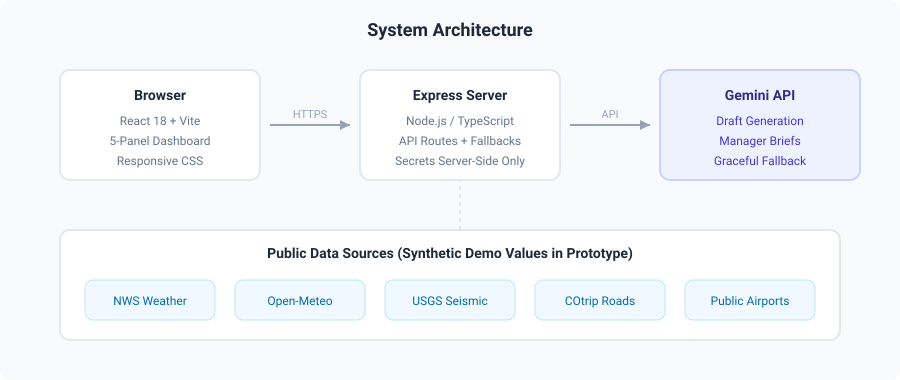

# FedEx Logistics Intelligence System

<p align="center">
  
</p>

## What This Is

The **FedEx Logistics Intelligence System** is a public-data decision-support prototype for station operations managers. It gives managers one calm place to review public external risk signals before a shift — weather, road conditions, and regional disruption context — without touching any internal FedEx data.

This is **not** a production FedEx system. It is **not** connected to internal package, route, employee, customer, security, or facility systems.

## Who It Helps

- **Station and sort managers** preparing a shift plan.
- **Linehaul and feeder leaders** watching public disruption signals.
- **Regional AI efficiency team members** who need a compelling but safe demo.
- **IT and AI governance reviewers** who need clear data boundaries.

## What The App Looks Like

<p align="center">
  
</p>

## Architecture

<p align="center">
  
</p>

## Verified Live App

| Property | Value |
| --- | --- |
| AI Studio app | `https://ai.studio/apps/6f606096-3be8-4ed9-a3d8-a0b27fde25af` |
| Cloud Run service | `fedex-logistics-intelligence-system` |
| Public URL | `https://fedex-logistics-intelligence-system-s77j6bxyra-ue.a.run.app` |
| Live revision | `fedex-logistics-intelligence-system-00005-4vs` |
| Verified | 2026-05-23 |

> ⚠️ The live service is a visual prototype. This repository now contains the **source-owned** rebuild that closes the 2026-05-23 live readiness audit.

## Source-Owned Rebuild (v2)

This repository now includes a complete, reviewable source tree in the [`app/`](app/) folder:

- **React 18 + Vite** frontend with 5 manager-friendly panels.
- **Express + TypeScript** backend with server-side Gemini integration.
- **Graceful fallback** when Gemini is unavailable.
- **Zero command-console language** — every label is written for busy operations managers.
- **Synthetic values clearly labeled** — no fake CCTV, parcel counts, or telemetry.
- **No live-action buttons** — only draft and verification tools.

### Quick Start

```bash
cd app/
npm install
cp .env.example .env
# Add GEMINI_API_KEY to .env (optional — app works without it)
npm run dev
# Open http://localhost:5173
```

See [`app/README.md`](app/README.md) for full build, deploy, and environment details.

### Five Manager-Friendly Panels

| Panel | What It Shows |
| --- | --- |
| **Shift Readiness** | Top three public risks for the next shift, with clear status labels: Normal, Watch, Verify, or Escalate. |
| **Station Impact** | Plain-English explanation of possible dock, yard, staffing, or handoff effects. Always marked "possible impact, not confirmed." |
| **Route Watch** | Public road/weather context for I-70, US-50, and alternate routes. Source links to cotrip.org on every card. |
| **Manager Drafts** | One-click generation of pre-shift huddle notes, shift handoffs, and after-action summaries. Uses Gemini when available; falls back to local templates. |
| **Source Trail** | A table of every signal, its origin, its type (public fact, model forecast, synthetic demo, manager note), and whether it needs internal verification. |

## Safety Framing

Every screen includes these protections:

- ✅ Visible **"Prototype only"** banner at the top.
- ✅ All synthetic values are **labeled directly** on the card.
- ✅ No button implies live dispatch, rerouting, package tracking, or official authority.
- ✅ Every AI draft includes **"Needs manager verification."**
- ✅ API keys are **server-side only** — never exposed to the browser.
- ✅ Source links on every public data card.

## Safe Demo Positioning

Use this sentence when presenting:

> This is a public-data decision-support prototype. It helps managers notice and explain regional risk faster, but it does not make operational decisions and it does not use FedEx internal data.

## Best Station-Ops Use Cases

1. Morning readiness brief.
2. Weather and road risk summary.
3. Pass-closure impact checklist.
4. Shift handoff draft.
5. After-action summary after a disruption.
6. AI idea intake from managers who want a new workflow.

See [manager workflows](manager-workflows.md) for examples.

## Public Data Strategy

Use public, non-sensitive sources only:

- National Weather Service forecasts and alerts.
- Open-Meteo weather model forecasts.
- USGS earthquake event data.
- COtrip public road condition context.
- Public FedEx location pages.
- Public Gunnison airport information.

See [OSINT data map](osint-data-map.md) for source notes and cautions.

## Do Not Use This For

- Real package tracking.
- Customer records.
- Employee records.
- Production route manifests.
- Live dispatch commands.
- Safety decisions without a human owner.
- External customer messages.
- Confidential FedEx operational data.

## Project Files

```text
app/                          ← Source-owned full-stack app (new in v2)
  README.md
  package.json
  server.ts
  vite.config.ts
  tsconfig.json
  .env.example
  src/
    main.tsx
    App.tsx
    index.css
    components/
      PrototypeBanner.tsx
      ShiftReadiness.tsx
      StationImpact.tsx
      RouteWatch.tsx
      ManagerDrafts.tsx
      SourceTrail.tsx
README.md                     ← This file
ai-studio-v2-prompt.md        ← Prompts for rebuilding in Google AI Studio
demo-script.md                ← How to present the prototype safely
governance-review.md          ← Data, risk, and approval notes
live-readiness-audit-2026-05-23.md  ← Audit that v2 closes
manager-workflows.md          ← Example manager use cases
osint-data-map.md             ← Public data source catalog
gcp-takeover-notes.md         ← Cloud Run deployment notes
```

## Foundry Track

The regional-intel workbench has a Foundry-ready export and Kadima discovery slice for this prototype.

Current state as of 2026-05-23:

- Kadima connectivity verified through the existing Foundry configuration.
- Ontology metadata is readable.
- The public/synthetic logistics packet exports cleanly with zero dropped rows.
- Upload is intentionally dry-run blocked until approved dataset RIDs are mapped for the regional and logistics object files.

See [the Foundry integration roadmap](../../docs/foundry-integration-roadmap.md) for the governed deployment path.

## Governance

See [governance-review.md](governance-review.md) for data classification, risk notes, and the human review path.

## Status

- [x] Live readiness audit documented.
- [x] Source-owned full-stack app built and tested.
- [x] Zero console errors at build time.
- [x] Synthetic values labeled.
- [x] No command-console language.
- [ ] Cloud Run v2 deployment (ready to deploy from `app/`).
- [ ] Foundry dataset RID mapping (dry-run blocked pending approval).
